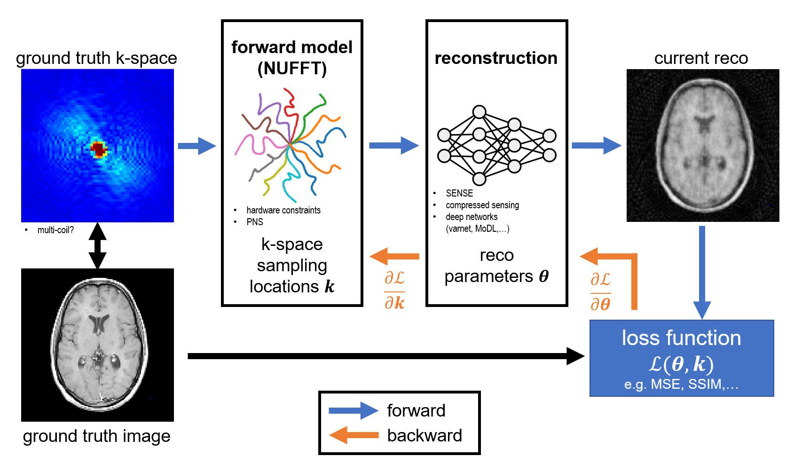
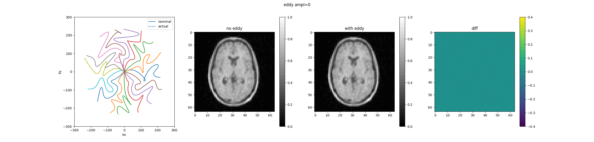

# demo: learning-based k-space trajectory design
**ESMRMB 2025 member session: Self-learning MR**

Contact: Felix Glang | Graz University of Technology | glang@tugraz.at

The demo is based on SNOPY (**S**tochastic optimization framework for 3D **NO**n-Cartesian sam**P**ling trajector**Y**) by Wang et al. (https://dx.doi.org/10.1002/mrm.29645) from the University of Michigan. \
Original code: https://github.com/guanhuaw/SNOPY

## Overview
There is a growing body of research on learning-based trajectory design, especially non-Cartesian and jointly learning a tailored NN-based reconstruction.

Below is a non-comprehensive overview of some published methods for learning-based design of non-Cartesian trajectories. All of them consider hardware limits, such as gradient amplitudes and slew rates. This means that, rather than learning sampling masks for Cartesian straight-line readouts, they learn true non-Cartesian trajectories.
| Method | Year | Code Availability | Comments |
|---|---|---|---|
| [SPARKLING](https://dx.doi.org/10.1002/mrm.27678) | 2019 | upon request | optimized for CS reco, fixed target sampling density, model-driven, no training data required |
| [3D-SPARKLING](https://dx.doi.org/10.1002/nbm.4349) | 2020 | upon request | stack-of-SPARKLING & full 3D |
| [PROJeCTOR](https://dx.doi.org/10.3390/bioengineering10020158) | 2023 | upon request | similar to SPARKLING, data-driven learning of trajectory & reco, projection-based enforcement of hardware constraints |
| [PILOT](https://dx.doi.org/10.59275/j.melba.2021-1a1f) | 2021 | https://github.com/tomer196/PILOT | end-to-end learning, option for TSP solver to connect sampling points |
| [3D-FLAT](https://dx.doi.org/10.1007/978-3-030-61598-7_1) | 2020 | https://github.com/3d-flat/3dflat | similar to PILOT, 3D |
| [BJORK](https://dx.doi.org/10.1109/TMI.2022.3161875) | 2022 | https://github.com/guanhuaw/Bjork | B-spline parametrization, analytical NUFFT Jacobian, end-to-end with reco |
| [SNOPY](https://dx.doi.org/10.1002/mrm.29645) | 2023 | https://github.com/guanhuaw/SNOPY | similar to BJORK, 3D, PNS penalty, general framework for arbitrary parametrizations |

### Main objectives
- make efficient use of gradient hardware -> acquisition speed
    - comply with amplitude and slew rate constraints
    - peripheral nerve stimulation
    - acoustic noise
- favourable properties for reconstruction
    - parallel imaging:
        - avoid large gaps between samples (noise amplification -> CAIPI)
        - ...but also not too close (multi-coil correlations -> Poisson disc)
    - compressed sensing:
        - incoherent PSF
        - variable sampling density
    - deep learning:
        - data-driven
        - tailored to specific anatomy?
        - tailored to downstream tasks (e.g. segmentation)?

### Challenges
- hardware imperfections (eddy currents, delays)
- many degrees of freedom
    - address by parametrization, e.g. splines
- many local minima
- training data
    - ideally complex multi-coil
 
## Schematic of the approach

## Optimization example

## Eddy current example

